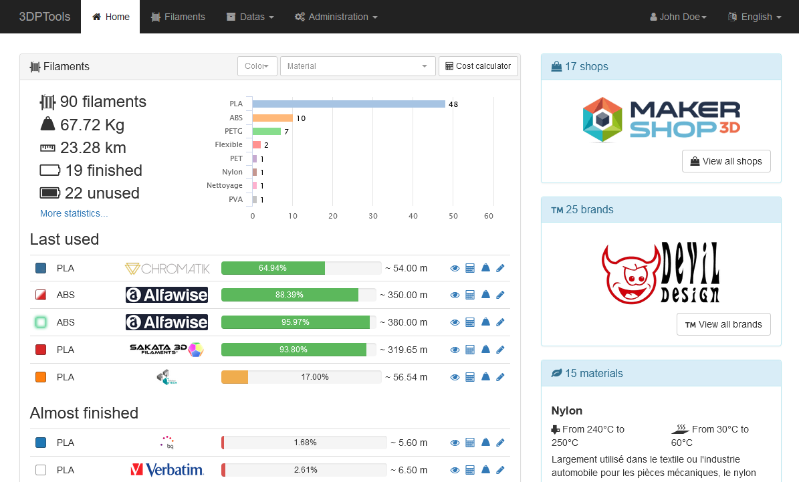

# 3DPTools

Web-based 3DPrinting tools. For now it allow you to manage your 3D printing filament collection.



The following features may be added in the future: resin collection management, 3D printers collection management, 
loading, visualisation and analyse of gcode file...

# Requirements

## Run

- [NodeJS](https://nodejs.org/) (12.x) with 
- ImageMagick
- [MongoDB](https://www.mongodb.com/) (>=3.6, **with [3.6 Feature compatibility enabled](https://docs.mongodb.com/manual/reference/command/setFeatureCompatibilityVersion/)**).  
  Tested and OK with MongoDB 4.0
- [Redis](http://redis.io/)
- Any OS where the previous requirements runs. Has been proven to work on Linux (Ubuntu and Debian tested) and Windows (Windows 10 tested).
- Of course MongoDB and Redis does not needs to run on the same host as the Node app.
- Docker (only if run as Docker containers)

## Dev/build

- Bower (`sudo npm install -g bower`)
- build-essential (as know on Debian-like OS, or any other equivalent on your OS ; needed to build some dependencies)
- SASS ([install dart-sass](https://sass-lang.com/install) or with npm: `sudo npm install -g sass`)
- Any OS where the previous requirements runs. Has been proven to work for development on Linux (Ubuntu and Debian tested) and Windows (Windows 10 tested).
- Docker (only to build docker image or run the development environment as Docker containers)

# Setup and run

## Manual

First, you need to get the code:

```shell
git clone git@gitlab.com:orobardet/3DPTools.git
cd 3DPTools/src
```

Then prepare it:

```shell
yarn install --production
bower install --production
scss -f public/stylesheets/style.scss > public/stylesheets/style.css
```

And finally run it:

```shell
NODE_ENV=production npm start
```
> **Note:** When running the application in a production environnement, you **MUST** set the environment variable 
> `NODE_ENV` to something different than `development` (which is the default value for ExpressJS if not set). 
> In `development` environment mode, the application will:
> - Show every details on screen (i.e. on the web pages) when an error occurs. This can be a **SECURITY** issue.
> - Run in debug mode, where caching and pre-compilation are not fully enabled. This can lead to **PERFORMANCE** issues.

## Using Docker

> Building the docker image of this application require at least **Docker v17.05** (multi-stage build)

A [docker-compose.yml](docker-compose.yml) file is provided to run this image using Docker. 
It start a Redis and a MongoDB (both in very basic and minimalist mode).

For Linux, MacOS, Window 10 1803+ or any OS having curl:

```shell
curl -o "docker-compose.yml" "https://gitlab.com/orobardet/3DPTools/raw/master/docker-compose.yml"
```

So you can start a instance with just :

```shell
docker-compose up -d
# (You can view logs with: docker-compose logs -f)
```

> ⚠ Warning: in this setup, the MongoDB instance **has not security enabled**.
> It is highly recommended to the MongoDB serveur by enabling auth. If so, you'll need to create a Mongo user with 
> access to the `3dptools` database (do **NOT** use the Mongo admin user), and configure the 3dptools container to use
> these credential. See [configuration of database](doc/en/configuration.md#database) documentation. You can use
> [environment variables](doc/en/configuration.md#environment-variables) in your local `docker-compose.yml` file.

When the main container starts, it first wait for redis and mongo to be up and running.
If these required services are not available within the allowed time (10 minutes by default), the container fails. 

Once the application has successfully start, you can access to 3DPTools using the url http://localhost:3000/. 
If no valid data is already found, the 3DPTools will start in setup mode. Just follow the instructions.

By default, the docker-compose environment will create a `docker-volumes` folder that will hold data for persistence: 
you can stop, kill and restart the Docker environment and still retreive all your data, as long as the `docker-volumes` is kept.

> Backup note: copying the `docker-volumes` directory to make a backup is acceptable 
> **only if done when the Docker environment is stopped**. To make a live backup (which is certainly what you want), 
> please use [the backup features of MongoDB](https://docs.mongodb.com/v3.2/core/backups/) directly

You can change some parameters of the docker-compose environment by creating a `docker-compose.override.yml` file. 
Common changes can be :
- the access port: override the `ports` mapping of the `3dptools` service
- the mapped volumes for data: override the `volumes` of the `mongo` service
- start 3dptools in development mode: add the environment variable `NODE_ENV=dev` in the `3dptools` service
- parameters for waiting for redis and mongo in the `3dptools` service using the following environment variables:
  - `WAIT_REDIS_MAX_TRIES`, `120` by default
  - `WAIT_REDIS_TRY_INTERVAL`, `5s` by default
  - `WAIT_MONGO_MAX_TRIES`, `120` by default
  - `WAIT_MONGO_TRY_INTERVAL`, `5s` by default

Some `docker-compose.override.yml` sample are provided in the files `docker-compose.override.dist.*.yml`

# Configuration

This application can be configured by giving it some parameters on startup. Most of the settings have default values. 

You can find configuration instructions and all available configuration settings [in the documentation](doc/en/configuration.md).

